# morefine S500 hackintosh

 
  

[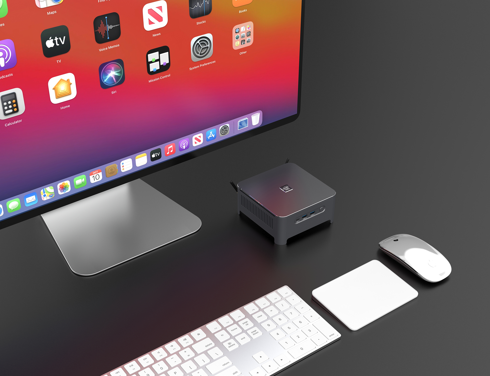](https://hackintosher.taobao.com)

## 电脑配置

|   规格    |                           详细信息                           |
| :-------: | :----------------------------------------------------------: |
| 电脑型号  |                        morefine S500                         |
| 操作系统  |           macOS `Monterey` / `Big Sur` / `Mojave`            |
|  处理器   |               英特尔 酷睿 i9-10880H 8核16线程                |
|   内存    |                      32 GB DDR4 2933MHz                      |
|  硬盘1/2  |   WD SN570 1TB/ 支持双NVMe或NVMe+SATA SSD或双SATA SSD   |
|  硬盘/3   |                    可接SATA 2.5寸硬盘/SSD                    |
|   显卡    |                    Intel UHD Graphics 630                    |
|  显示器   |                              无                              |
|   声卡    |                   Realtek ALC662 `alcid=5`                   |
| 无线网卡  | m.2 NGFF插槽，默认出厂为 `Intel AX200` 已更换为[BCM94360Z3](https://blog.daliansky.net/uploads/WeChatandShop.png) |
| 有线网卡1 |   **Realtek RTL8168H/8111H PCI Express Gigabit Ethernet**    |
| 有线网卡2 |   **Realtek RTL8168H/8111H PCI Express Gigabit Ethernet**    |

## 更新日志

- 3-28-2022
  
  - Release `v1.4.0`
  - 更新 `OpenCore` `v0.7.9`
  - 修复对 `DP ` / `HDMI` 的音频支持
  - 修复 `DP` / `HDMI` 双4K屏幕同时点亮的问题
  - 将机箱背面的两个USB 2.0的端口内建，用于键盘和鼠标的接收器，以便解决睡眠无法唤醒的问题
  - 移除多余的 `Boot Args` 参数，提高开机速度
  
- 2-7-2022

  - Release `v1.3.0`
  - 更新 `OpenCore` `v0.7.8`
  - 支持 `通用控制`
  - 新增对 `Mojave` 的支持

- 1-11-2022

  - Release `v1.2.0`
    - 更新 `OpenCore` `v0.7.7`
    - 新增 `morefine` 主题

- 11-10-2021

  - Release `v1.1.0`
    - 支持 `Type-C` + `DP` + `HDMI` 三屏输出(HDMI 4k@30hz)
    - 更新 `OpenCore` `v0.7.6`

- 10-19-2021

  - Release `v1.0.0`
    - 默认支持 `Type-C` + `DP` 双显输出，未来会提供`DP` + `HDMI` 双显输出
    - 更新 `OpenCore` 为 `v0.7.5`
    - 请使用工具  [OCAT_Mac.dmg](https://github.com/ic005k/QtOpenCoreConfig/releases) 编辑 `config.plist` 

  

### 设置`BIOS`

[BIOS设置图文教程](https://github.com/daliansky/morefine-S500-Hackintosh/wiki/BIOS设置)

- 安全菜单：

  - 安全启动 -> `关闭`  (*Disable Secure Boot*)

- 高级菜单：

  - CPU菜单：`CFG Lock` -> `关闭` (*Disabling CFG Lock*)【相关BIOS请进群获取】

- 设备：

  - 显示设备
    - 预指派内存大小：`64MB` (*DVMT* pre-allocated memory)

  - ATA设备菜单：
    - `配置SATA为` -> `AHCI`

- 其它参数默认即可

## 安装教程

[morefine S500 黑苹果安装教程](https://github.com/daliansky/morefine-S500-Hackintosh/wiki/安装教程)

[BCM94360Z3驱动教程](https://github.com/daliansky/morefine-S500-Hackintosh/wiki/BCM94360Z3%E4%B8%89%E5%A4%A9%E7%BA%BF)

## morefine S500评测

[请点击前往](https://www.bilibili.com/video/bv1dL4y1v7yx)

## 注意事项

登录 `Apple ID` 之前，请务必重新生成三码，否则有可能会导致无法登录 `App Store`，教程详见群公告里的链接

[解决无法登录app store教程](https://github.com/daliansky/morefine-S500-Hackintosh/wiki/%E8%A7%A3%E5%86%B3-app-store-%E6%97%A0%E6%B3%95%E7%99%BB%E5%BD%95)

[DP转HDMI请移步这里](https://github.com/daliansky/morefine-S500-Hackintosh/wiki/%E5%85%B3%E4%BA%8EDP%E8%BD%ACHDMI%E7%9A%84%E8%BE%93%E5%87%BA%E7%BA%BF%E6%9D%90)

## 截屏

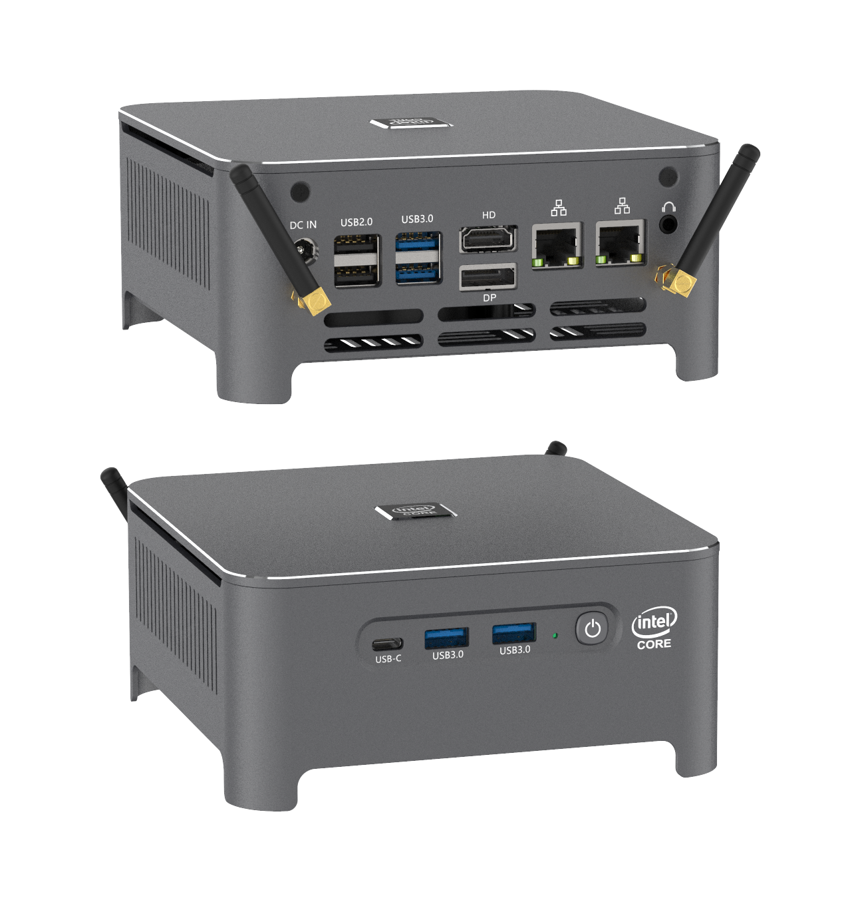

### 支持通用控制

### 支持 `Mojave`

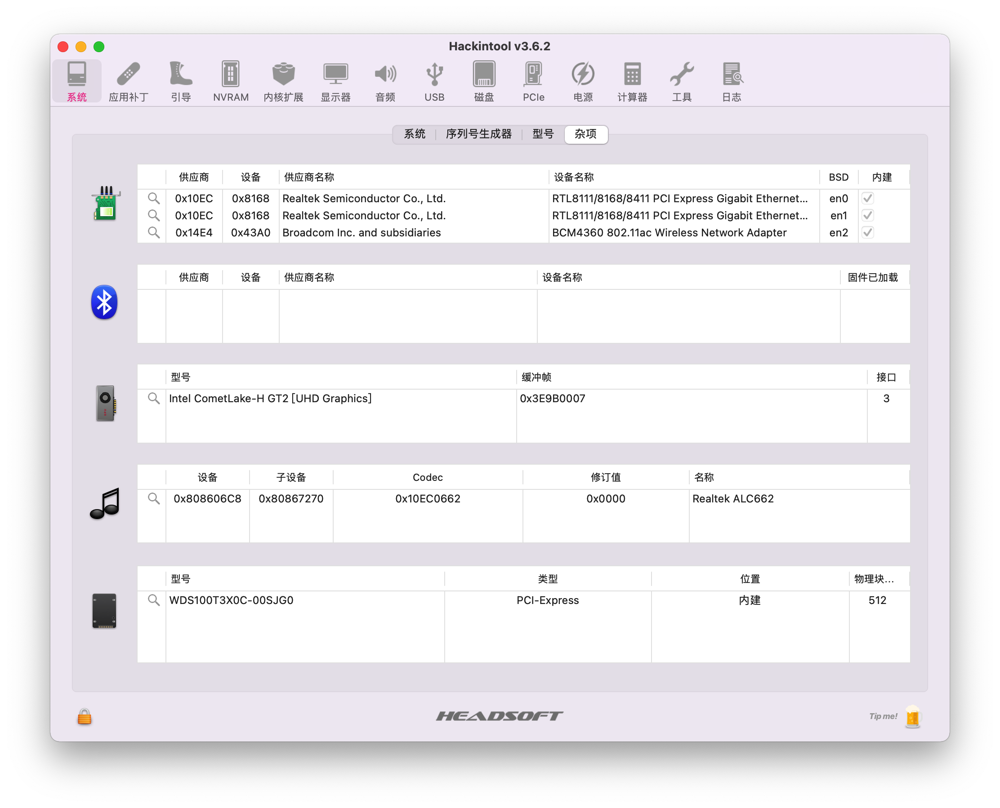

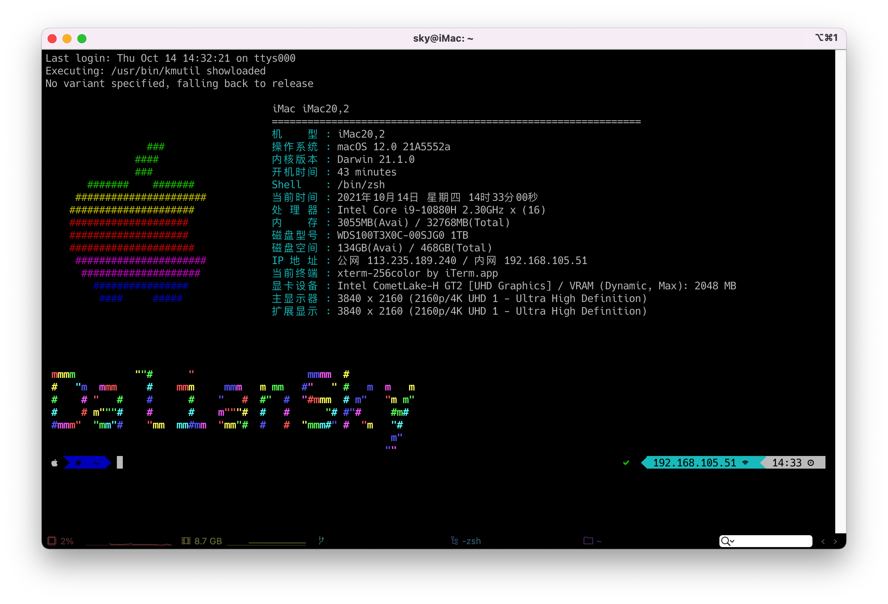

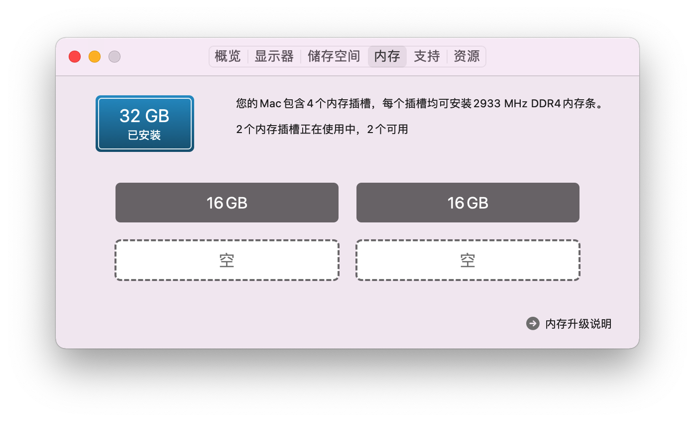

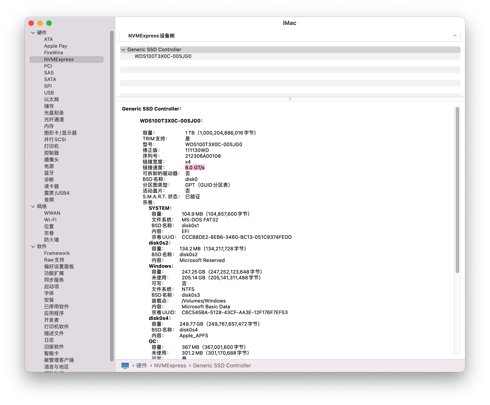

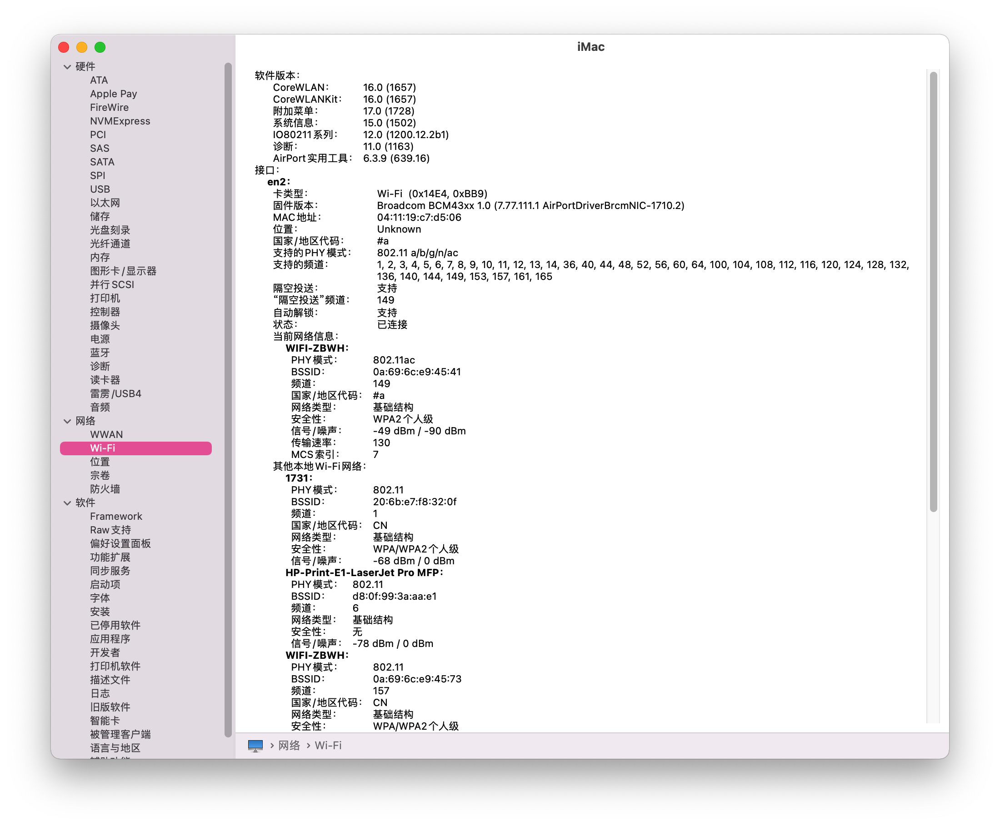

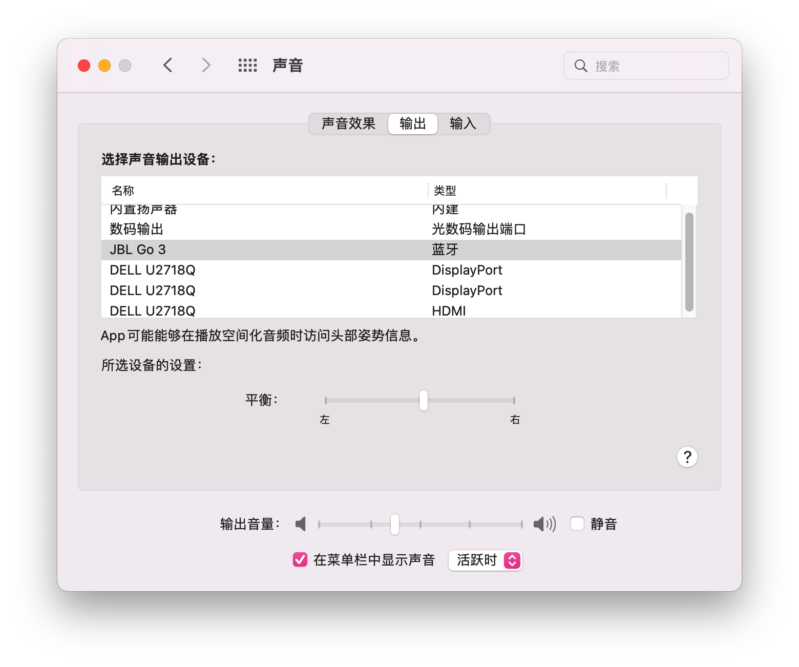

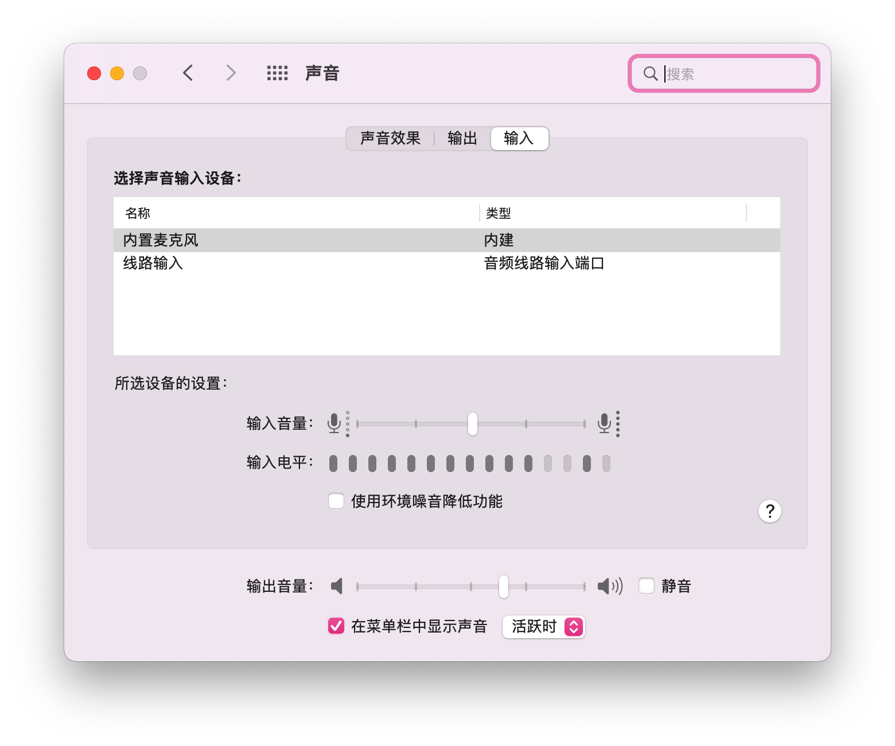

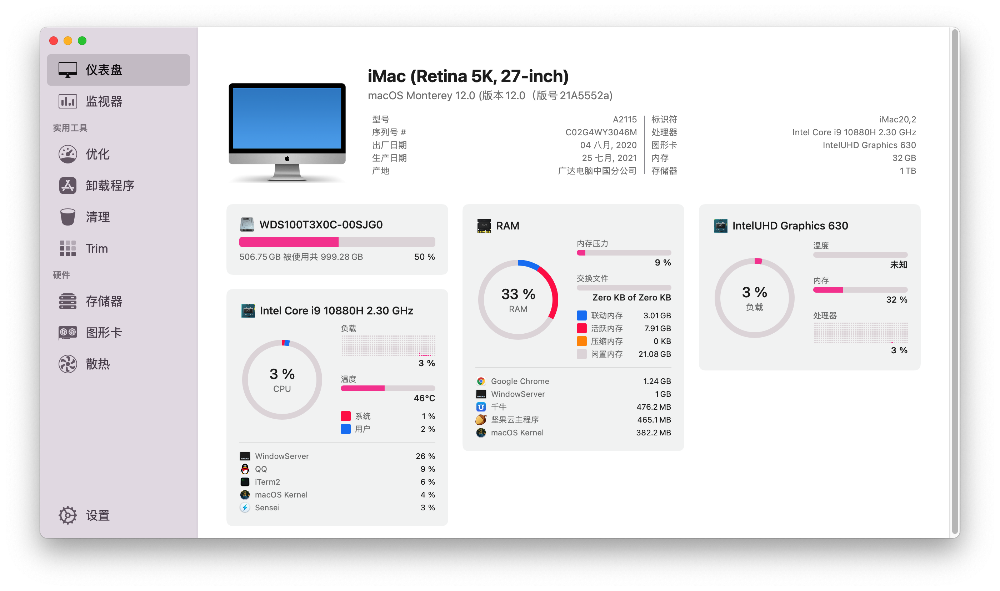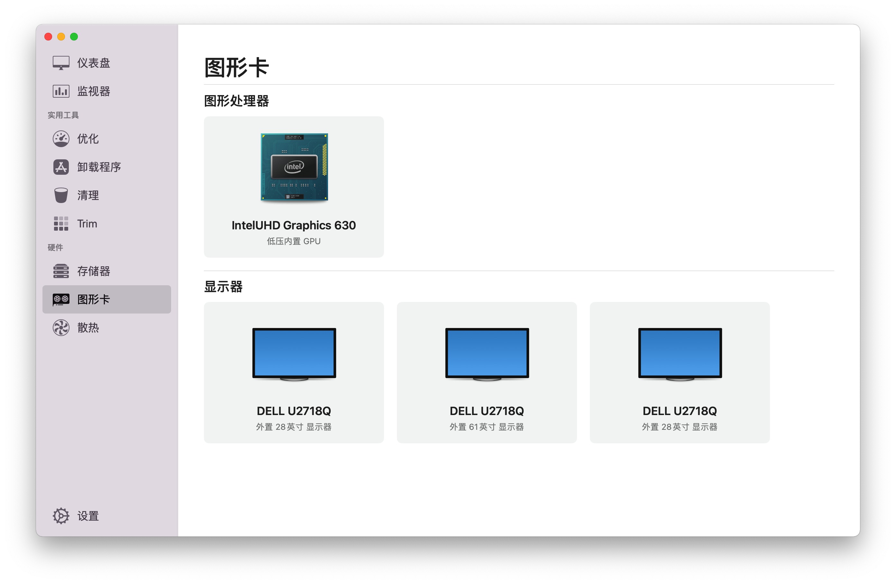

## 其它信息

morefine 黑苹果交流群：[275356796](https://qm.qq.com/cgi-bin/qm/qr?k=H7hFwiVkZq71L7se6rz3hE9QcacqL-dV&jump_from=webapi)

morefine S500购买链接：[黑果小兵的部落阁](https://hackintosher.taobao.com/) 

## 感谢名单：

- [Apple](https://apple.com/) for macOS;
- [Acidanthera](https://github.com/acidanthera) for OpenCore and all the lovely hackintosh work.
- [Dortania](https://dortania.github.io/OpenCore-Install-Guide/config-laptop.plist/icelake.html) For great and detailed guides.

